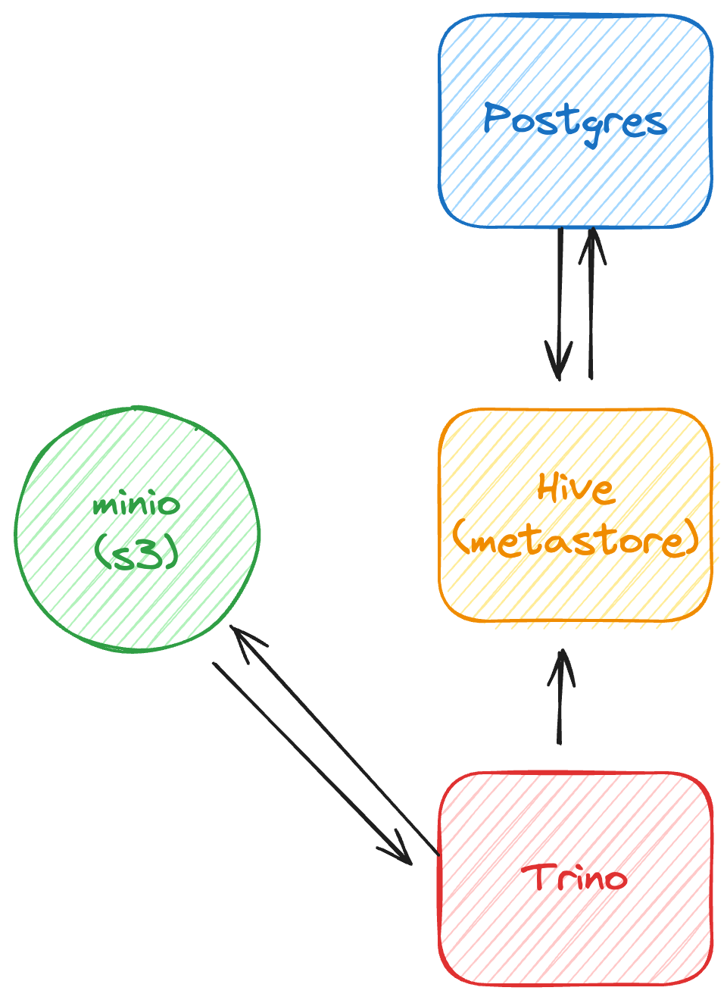

# K8S Datalake

- Local 환경의 k8s 에서 datalake 를 띄우는 설정입니다.



## prerequisite
- Local 에 Docker Desktop 의 K8S 가 활성화되어있어야합니다.

## 세팅

datalake 환경에서 사용할 namespace 를 생성해주세요. (`ns-datalake`)
```shell
kubectl create namespace ns-datalake;
```

- storage 를 휘발해서 사용하지 않기 위해서 storage 관련된 yaml 은 분리했습니다. storage 관련된 yaml 은 최초 1회만 실행해주세요.
```shell
kubectl apply -f ./templates/metastore/hive.storage.yaml
kubectl apply -f ./templates/minio/minio.storage.yaml
kubectl apply -f ./templates/postgres/postgres.storage.yaml
```

flink-kubernetes-operator 설치
```shell
helm install flink-kubernetes-operator flink-operator-repo/flink-kubernetes-operator  --set webhook.create=false -n ns-datalake
```

- [링크](https://nightlies.apache.org/flink/flink-kubernetes-operator-docs-main/docs/try-flink-kubernetes-operator/quick-start/) 참고.
- namespace 를 default 를 쓰지 않기 때문에(?) 에러가 발생하는 것 같습니다. cert-manager 를 설치하지 않고 webhook.create=false 옵션을 주고 operator 를 설치합니다.


## 서비스들 띄우기

### S3 로 사용될 minio 띄우기.
```shell
kubectl apply -f ./templates/minio/minio.yaml
# 최초 1회엔 아래 job을 통해서 minio 를 세팅해줘야합니다. 한번 실행하고 나면 계속 세팅되어있어서 재실행할 필요가 없습니다.
kubectl apply -f ./templates/minio/mc-setup.job.yaml
```
내릴 땐 `kubectl delete -f `

### Metastore 로 사용할 hive, postgres 띄우기
hive 와 postgres 사이엔 의존성이 있기 때문에 postgres 먼저 띄워줍니다.

postgres
```shell
kubectl apply -f ./templates/postgres/postgres.yaml
```
hive
```shell
kubectl apply -f ./templates/metastore/metastore-cfg.yaml

kubectl apply -f ./templates/metastore/hive.deploy.yaml
```

내릴 땐 `kubectl delete -f `
### Trino 띄우기
```shell
kubectl apply -f ./templates/trino/configmap.yaml

kubectl apply -f ./templates/trino/trino.yaml
```

내릴 땐 `kubectl delete -f `

### Kafka 띄우기
kafka 는 helm 이기 때문에 helm 으로 install 해줍니다.
```shell
cd templates/kafka

# 띄우기. 
helm install -f ./values.yaml kafka . -n ns-datalake 

# 내리기.
helm uninstall kafka -n ns-datalake
```


## 사용해보기

### Trino 연결하기

조건
- port-forward 로 trino 를 localhost:8080 으로 연결 필요.
- tools/trino 의 권한을 +x `chmod +x tools/trino`
- iceberg connector 연결은 configmap 으로 하긴 했지만 확인 필요.
  - https://trino.io/docs/current/object-storage/file-system-s3.html
  - https://trino.io/docs/current/connector/iceberg.html

방법
```shell
./trino localhost:8080

$ SELECT 1;
```

### avro 해석하기
- https://www.starburst.io/blog/iceberg-metadata/ 참고.

```shell
# manifest-list.avro 파일은 어디선가 다운로드 받았다고 가정.
java -jar ./tools/avro-tools-1.9.1.jar tojson ./manifest-list.avro | jq .
```